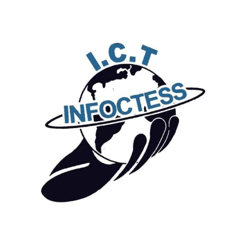

# INFOCTESS Koneqt - Koneqt, Learn, Impact

INFOCTESS Koneqt is a mobile application developed by ARK Softwarez for the members of INFOCTESS - UEW. The app provides a platform for members to connect, collaborate, and access various resources essential to their academic journey.

## Features

- **Member Exclusive Access:** Only INFOCTESS members can sign up and use the app, ensuring a secure and trusted environment.

- **Chat with Friends:** Engage in real-time communication with other members, making it easy to coordinate and collaborate on academic activities.

- **Community Forum:** Post to the community forum to share knowledge, ask questions, and participate in discussions.

- **News and Events:** Stay up-to-date with the latest news and events related to the student society and your academic journey.

- **Academic Utilities:** Access a variety of academic utilities such as past questions, schedules, GPA calculator, notes, courses, and more.

- **StudyMate AI:** Interact with our AI Studymate powered by Articifial Intelligence to enhance your learning experience.

- **AI Imager:** Utilize the AI Imager based on DALL-E to generate custom images for your study materials.

- **External Resources:** Easily access external resources, such as PDFdrive.com, for additional study materials.

## Installation and Usage

1. Clone this repository.

2. Install Flutter if you haven't already. Refer to the [Flutter documentation](https://flutter.dev/docs/get-started/install) for installation instructions.

3. Run the following command to get all the required dependencies:

4. Connect your device or use an emulator, and then run the app with:

5. The app will launch on your device or emulator, and you can now start exploring its features.

## Privacy Policy

Before using the INFOCTESS Koneqt app, please review our [Privacy Policy](privacy.txt) to understand how we collect, use, and store your personal information.

## Terms and Conditions

By using the INFOCTESS Koneqt app, you agree to abide by our [Terms and Conditions](terms.txt). Make sure to read and understand them before using the app.

## Support

If you encounter any issues, have questions, or need assistance with the app, please contact our support team at [email protected]

## Contributing

We welcome contributions to improve the INFOCTESS Koneqt app. If you find any bugs, have feature requests, or want to contribute code, please open an issue or submit a pull request.

## License

This project is licensed under the [MIT License](License.txt).

---
*INFOCTESS Koneqt is a product of ARK Softwarez. All rights reserved.*

